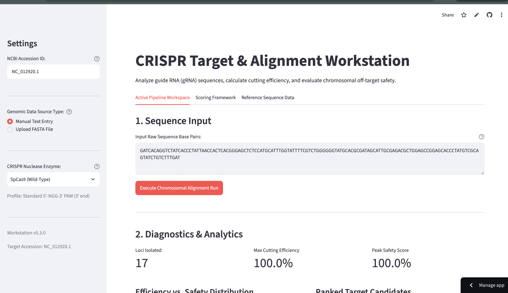
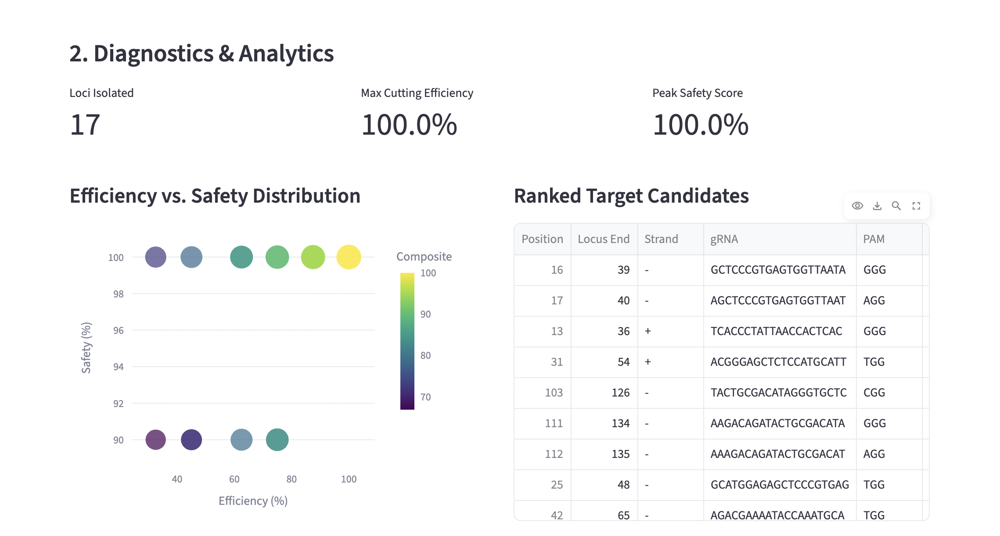
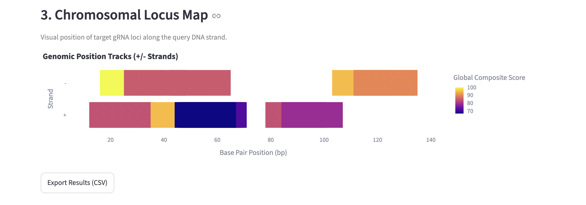

# CRISPR Computational Workstation

A web-based bioinformatics application designed to evaluate guide RNA (gRNA) cutting efficiency, target locus alignment, and off-target chromosomal safety across customizable nuclease variants and reference genomes.

---

## Interface Preview

| **Full Workspace & Controls** | **Analytics & Target Rankings** | **Chromosomal Locus Map** |
| :---: | :---: | :---: |
|  |  |  |

---

## Key Features

- **Dynamic Reference Genome Ingestion:** Integrates directly with the **NCBI Entrez E-utilities API** to fetch and analyze any valid NCBI Nucleotide Accession ID in real time (e.g., Human mtDNA `NC_012920.1`, *E. coli*, etc.).
- **Rigorous Off-Target Safety Scoring:** Implements the non-linear **MIT Hsu-Zhang position-weighted mismatch matrix model** to evaluate mismatch count, position penalties, and spatial clustering along target loci.
- **Multi-Nuclease Support:** Built-in PAM motif regex parsers for **SpCas9 (Wild-Type)**, **SpCas9-VQR**, and **Cas12a (Cpf1)**.
- **Cutting Efficiency Metrics:** Evaluates GC content balance and penalizes premature Pol III transcription termination signals (`TTTT`).
- **Interactive Visualizations:** Powered by Plotly, offering interactive Efficiency vs. Safety scatter plots and numerical genomic locus position track maps.
- **Data Export:** Instant CSV export for downstream experimental validation.

---

## Biological & Mathematical Frameworks

### 1. Efficiency Score Formula
GC content is evaluated for an optimal range (40% - 60%) alongside sequence-specific penalties:

$$\text{Efficiency} = \max(0, 100 - |50 - \text{GC}| \times 2.5) - \text{PolyT\_Penalty}$$

### 2. MIT Hsu-Zhang Off-Target Model
Cleavage probability across mismatch positions relative to the PAM site is computed via:

$$\text{Cleavage Probability} = \left(\prod_{p \in M} (1 - w_p)\right) \times \left(\frac{1}{\frac{19 - d_{\text{avg}}}{19} \times 4 + 1}\right) \times \left(\frac{1}{n^2}\right)$$

*Where $w_p$ represents position-specific weights, $d_{\text{avg}}$ is the average distance between mismatches, and $n$ is the total mismatch count.*

---

## Quickstart & Local Installation

### Prerequisites
- Python 3.9 or higher

### Installation

1. **Clone the repository:**
   git clone https://github.com/YOUR_USERNAME/YOUR_REPO_NAME.git
   cd YOUR_REPO_NAME

2. **Install dependencies:**
   pip install -r requirements.txt

3. **Launch the workstation:**
   streamlit run app.py

---

## Citations

- **Hsu, P., Scott, D., Weinstein, J. et al.** *DNA targeting specificity of RNA-guided Cas9 nucleases.* Nature Biotechnology **31**, 827–832 (2013).
- **NCBI Entrez API:** National Center for Biotechnology Information (NCBI) Data API.

---

## License

Distributed under the MIT License. See `LICENSE` for more information.
